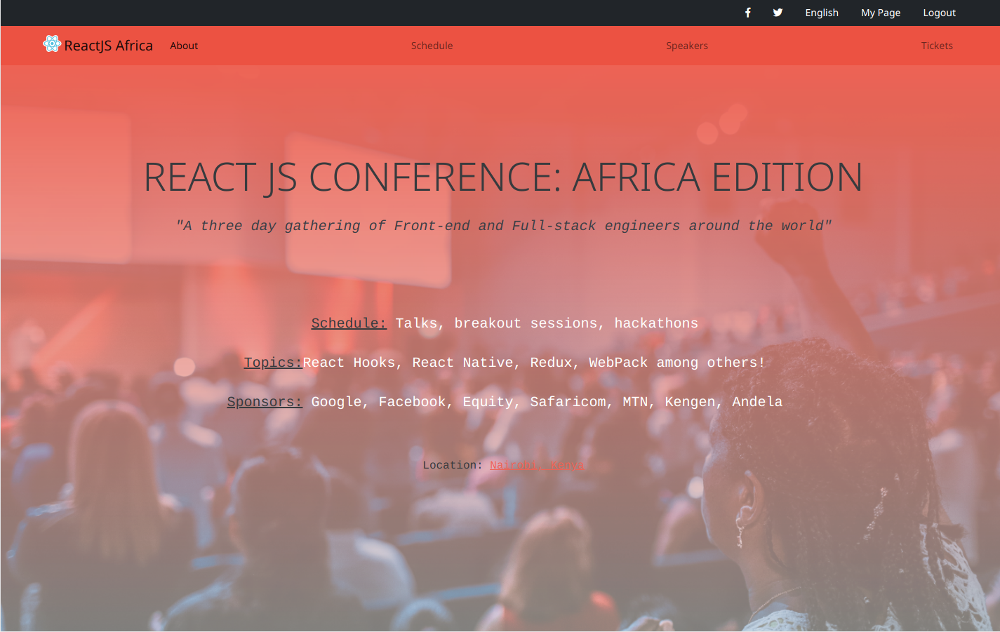

# HTML/CSS Capstone Project

This webiste was done as the final /capstone project of the Micorverse's HTML/CSS curriculum

The website is a landing page for a Web Developer's conference, with a page for tickets.

The main page and the tickets page are responsive in two breakpoints.

 
## Built With

- HTML5
- CSS3
- CSS grid and Flexbox
- Bootstrap

## Live Demo

[Live Demo Link](https://kimothokamau.github.io/html-css-capstone/)

👤 **Kimotho Kamau**

- GitHub: [@kimothokamau](https://github.com/kimothokamau)
- Twitter: [@kimothokk](https://twitter.com/kimothokk)

## 🤝 Contributing

Contributions, issues, and feature requests are welcome!

Feel free to check the [issues page](https://github.com/kimothokamau/html-css-capstone/issues/1).

## Show your support

Give a ⭐️ if you like this project!

## 📝 License

This project is [MIT](LICENSE) licensed.
