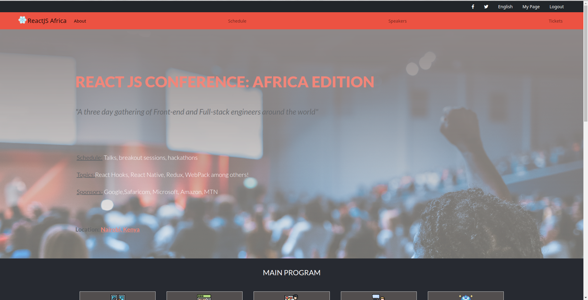
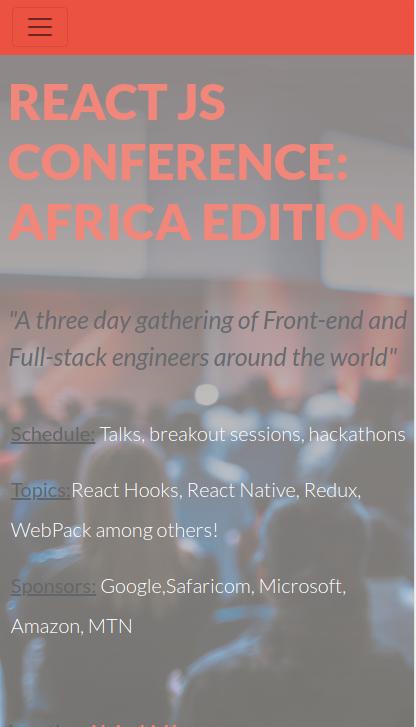

# HTML/CSS Capstone Project

This website was done as the final /capstone project of the Micorverse's HTML/CSS curriculum

It is a website for a web developer conference. It has the main landing page, an about us page and a tickets page.

The main page and the tickets page are responsive on two breakpoints: under 768px and over 768px

> Desktop screenshots (over 768px)

> Mobile screenshots (under 768px)

 
## Built With

- HTML5
- CSS3
- CSS grid and Flexbox
- Bootstrap

## Live Demo

[Live Demo Link](https://kimothokamau.github.io/html-css-capstone/)

👤 **Kimotho Kamau**

- GitHub: [@kimothokamau](https://github.com/kimothokamau)
- Twitter: [@kimothokk](https://twitter.com/kimothokk)

## 🤝 Atrribution

This design is an idea originally by [Cindy Shin on Behance](https://www.behance.net/adagio07)

This is the original design layout: [https://www.behance.net/gallery/29845175/CC-Global-Summit-2015]

## 🤝 Contributing

Contributions, issues, and feature requests are welcome!

Feel free to check the [issues page](https://github.com/kimothokamau/html-css-capstone/issues).

## Show your support

Give a ⭐️ if you like this project!

## 📝 License

This project is [MIT](LICENSE) licensed.
